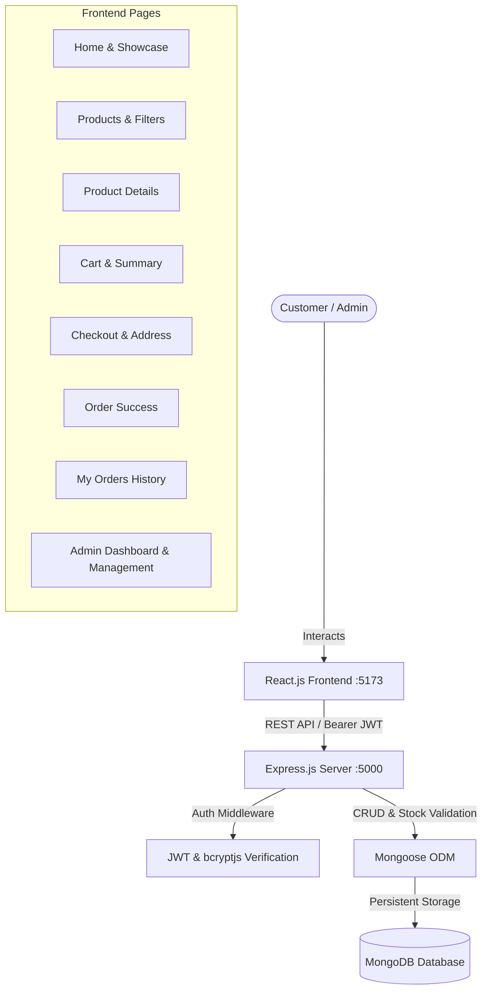

# 🛍️ ShopSphere — Full-Stack Mini E-Commerce Website

A modern, responsive, and fully functional **Full-Stack Mini E-Commerce Platform** built with **React.js**, **Node.js**, **Express.js**, and **MongoDB/Mongoose**.

---

## 🌟 Highlights & Features

### 👤 Customer Experience
* **User Authentication**: Secure signup and login powered by **JWT (JSON Web Tokens)** and **bcrypt password hashing**.
* **Product Catalog**: Dynamic catalog loaded directly from MongoDB with pagination, search, category filters, and price ranges.
* **Product Details**: High-resolution gallery, customer ratings, real-time stock availability, specifications, and related products recommendations.
* **Smart Shopping Cart**:
  * Persistent storage for authenticated users and local persistence for guests.
  * Real-time stock validation (prevents ordering beyond available stock).
  * Quantity increment/decrement steppers and removal.
  * Live calculations: Subtotal, Shipping charges, and Automatic Promotional Discounts.
* **Simulated Checkout**:
  * Customer and delivery address validation (Name, Phone, Address, City, State, Pincode).
  * Demo payment option: *"Cash on Delivery / Demo Payment"*.
  * Immediate stock decrement upon order confirmation.
* **Order Confirmation & Tracking**:
  * Real-time Order Confirmation screen with unique MongoDB Order ID.
  * My Orders page displaying order history with status color badges (*Processing, Confirmed, Shipped, Delivered, Cancelled*).

### 🛡️ Admin Dashboard & Management
* **Role-Based Protection**: Strict middleware security restricting administrative views to users with the `admin` role.
* **Live Store Analytics**:
  * Total Store Revenue / Sales
  * Total Orders Count
  * Total Active Products
  * Registered Users Count
  * Low Stock Alerts (< 5 items remaining)
* **Product Catalog Management**:
  * Add new products with full specifications, images, pricing, and stock.
  * Edit existing products with pre-filled forms.
  * Delete products with safe confirmation.
* **Order Lifecycle Management**:
  * View all customer orders.
  * Update order delivery statuses in real time.

---

## 🛠️ Technology Stack

| Layer | Technologies Used |
| :--- | :--- |
| **Frontend** | React 18, React Router v6, Axios, Lucide React, Custom Responsive Vanilla CSS |
| **Backend** | Node.js, Express.js (ES Modules), CORS, Dotenv |
| **Database** | MongoDB & Mongoose (supports Local MongoDB, MongoDB Atlas, & In-Memory fallback) |
| **Security** | JWT (jsonwebtoken), bcryptjs, Express Error Handlers |
| **Tooling** | Vite, Nodemon, Git |

---

## 📐 Architecture & Flow Diagram



---

## 📁 Project Structure

```text
e-commerce/
│
├── backend/
│   ├── config/
│   │   └── db.js                 # MongoDB connection & in-memory dev fallback
│   ├── controllers/
│   │   ├── authController.js     # Register, Login, Profile
│   │   ├── productController.js  # Catalog, Filters, Search, Admin CRUD
│   │   ├── cartController.js     # Add, Update, Remove, Clear
│   │   ├── orderController.js    # Create Order, Stock decrement, History
│   │   └── adminController.js    # Metrics, Users, Orders, Status Update
│   ├── middleware/
│   │   ├── authMiddleware.js     # JWT Bearer verification
│   │   ├── adminMiddleware.js    # Admin role guard
│   │   └── errorMiddleware.js    # 404 & Centralized error handler
│   ├── models/
│   │   ├── User.js               # User Schema with bcrypt hook
│   │   ├── Product.js            # Product Schema with virtuals & specs
│   │   ├── Cart.js               # Cart Schema with total calculations
│   │   └── Order.js              # Order Schema with delivery details
│   ├── routes/
│   │   ├── authRoutes.js         # /api/auth/*
│   │   ├── productRoutes.js      # /api/products/*
│   │   ├── cartRoutes.js         # /api/cart/*
│   │   ├── orderRoutes.js        # /api/orders/*
│   │   └── adminRoutes.js        # /api/admin/*
│   ├── seed/
│   │   └── seedProducts.js       # 21 realistic products + Demo users
│   ├── .env.example              # Environment template
│   ├── .env                      # Local environment configuration
│   ├── package.json
│   └── server.js                 # Express server entry point
│
├── frontend/
│   ├── public/
│   │   └── favicon.svg           # Branded favicon
│   ├── src/
│   │   ├── components/
│   │   │   ├── Navbar.jsx        # Responsive navigation with badge & menu
│   │   │   ├── Footer.jsx        # Professional 4-column footer
│   │   │   ├── ProductCard.jsx   # Interactive product card
│   │   │   ├── ProductGrid.jsx   # Grid with loading skeleton & empty state
│   │   │   ├── Loading.jsx       # Spinners & Skeletons
│   │   │   ├── ProtectedRoute.jsx# Auth & Admin route guards
│   │   │   └── Toast.jsx         # Notification alert system
│   │   ├── context/
│   │   │   ├── AuthContext.jsx   # Global user state & JWT handling
│   │   │   └── CartContext.jsx   # Global cart state & calculations
│   │   ├── pages/
│   │   │   ├── Home.jsx          # Hero, categories, featured items, reviews
│   │   │   ├── Products.jsx      # Catalog with search, filter, sort
│   │   │   ├── ProductDetails.jsx# Detailed view & related products
│   │   │   ├── Cart.jsx          # Cart review & pricing breakdown
│   │   │   ├── Checkout.jsx      # Address input & demo payment
│   │   │   ├── OrderSuccess.jsx  # Order confirmation & summary
│   │   │   ├── Orders.jsx        # Order history with status badges
│   │   │   ├── Profile.jsx       # User profile details
│   │   │   ├── Login.jsx         # Sign in with instant demo fill buttons
│   │   │   ├── Register.jsx      # Sign up form
│   │   │   ├── AdminDashboard.jsx# Metrics & inventory alerts
│   │   │   ├── AdminProducts.jsx # Products CRUD table & modal
│   │   │   └── AdminOrders.jsx   # Orders management & status update
│   │   ├── services/
│   │   │   └── api.js            # Axios client with interceptors
│   │   ├── App.jsx               # React Router layout & configuration
│   │   ├── main.jsx              # DOM Mount
│   │   └── index.css             # Complete design system & custom CSS
│   ├── index.html
│   ├── vite.config.js
│   └── package.json
│
├── .gitignore
├── package.json                  # Root runner scripts
└── README.md                     # Documentation
```

---

## 🚀 Getting Started & Installation

### Prerequisites
* **Node.js** (v18 or newer)
* **npm** (v9 or newer)
* **MongoDB** (Optional: local MongoDB server, MongoDB Atlas URI, or the automatic development in-memory database)

### Step 1: Clone the Repository
```bash
git clone <repository-url>
cd e-commerce
```

### Step 2: Install Dependencies
Install dependencies for both backend and frontend:
```bash
# Backend dependencies
cd backend
npm install

# Frontend dependencies
cd ../frontend
npm install
```
*(Or run `npm run install:all` from the root directory).*

---

## 🗄️ Database Setup & Configuration

### Option A: Automatic In-Memory MongoDB (Zero-Configuration Demo)
If you don't have MongoDB installed locally, our server will **automatically launch an in-memory MongoDB instance** and seed 21 products and demo accounts for you right out of the box!

### Option B: Local MongoDB
Ensure your local MongoDB service is running on the standard port:
```env
# backend/.env
MONGO_URI=mongodb://127.0.0.1:27017/mini_ecommerce
PORT=5000
JWT_SECRET=super_secret_jwt_key_mini_ecommerce_2025_999888
NODE_ENV=development
```

### Option C: MongoDB Atlas (Cloud)
Create a free database cluster on [MongoDB Atlas](https://www.mongodb.com/cloud/atlas) and update `backend/.env`:
```env
MONGO_URI=mongodb+srv://<username>:<password>@cluster0.mongodb.net/mini_ecommerce?retryWrites=true&w=majority
PORT=5000
JWT_SECRET=your_production_secret_key
NODE_ENV=production
```

---

## 🌱 Database Seeding

To populate the database with 21 sample products and pre-configured accounts:
```bash
cd backend
npm run seed
```

---

## 🔑 Demo Login Credentials

For quick evaluation, convenient **Instant Demo Autofill** buttons are available directly on the login page:

| Role | Email | Password | Permissions |
| :--- | :--- | :--- | :--- |
| **Admin** | `admin@example.com` | `Admin@123` | Full administrative control, Dashboard, Product CRUD, Order Status Updates |
| **Customer** | `user@example.com` | `User@123` | Store browsing, Cart, Checkout, Order Tracking |

---

## 🏃 Running the Application

### 1. Start the Backend API Server
```bash
cd backend
npm run dev
```
*API will run at:* `http://localhost:5000`
*Health check:* `http://localhost:5000/api/health`

### 2. Start the Frontend React App
```bash
cd frontend
npm run dev
```
*Frontend will run at:* `http://localhost:5173`

---

## 📡 REST API Documentation

### Authentication (`/api/auth`)
| Method | Endpoint | Access | Description |
| :--- | :--- | :--- | :--- |
| `POST` | `/api/auth/register` | Public | Register new user account |
| `POST` | `/api/auth/login` | Public | Authenticate user & return JWT |
| `GET` | `/api/auth/profile` | Private | Retrieve logged-in user profile |

### Products (`/api/products`)
| Method | Endpoint | Access | Description |
| :--- | :--- | :--- | :--- |
| `GET` | `/api/products` | Public | Get products with search, category, price, sort & pagination |
| `GET` | `/api/products/categories/list` | Public | Get list of distinct product categories |
| `GET` | `/api/products/:id` | Public | Get product details & related products |
| `POST` | `/api/products` | Admin | Create a new product |
| `PUT` | `/api/products/:id` | Admin | Update an existing product |
| `DELETE` | `/api/products/:id` | Admin | Delete a product |

### Cart (`/api/cart`)
| Method | Endpoint | Access | Description |
| :--- | :--- | :--- | :--- |
| `GET` | `/api/cart` | Private | Fetch authenticated user's cart |
| `POST` | `/api/cart` | Private | Add product or increment quantity |
| `PUT` | `/api/cart/:productId` | Private | Update quantity of a cart item |
| `DELETE` | `/api/cart/:productId` | Private | Remove item from cart |
| `DELETE` | `/api/cart` | Private | Clear entire cart |

### Orders (`/api/orders`)
| Method | Endpoint | Access | Description |
| :--- | :--- | :--- | :--- |
| `POST` | `/api/orders` | Private | Validate stock, place order & clear cart |
| `GET` | `/api/orders` | Private | Get logged-in user's order history |
| `GET` | `/api/orders/:id` | Private | Get specific order confirmation details |

### Admin (`/api/admin`)
| Method | Endpoint | Access | Description |
| :--- | :--- | :--- | :--- |
| `GET` | `/api/admin/stats` | Admin | Overall revenue, order count, users & products stats |
| `GET` | `/api/admin/users` | Admin | List all registered users |
| `GET` | `/api/admin/orders` | Admin | List all customer orders |
| `PUT` | `/api/admin/orders/:id/status` | Admin | Update order status (*Processing*, *Shipped*, etc.) |

---

## 🧪 Testing Checklist

- [x] **Product Catalog**: Loaded from MongoDB with search, category, and price range filters.
- [x] **Product Details**: Shows specifications, reviews, and stock limits.
- [x] **Cart Management**: Quantity stepper enforced by product inventory levels.
- [x] **User Authentication**: Registration, Login, Logout, JWT token management.
- [x] **Checkout Flow**: Address validation, subtotal calculation, free shipping on ₹999+, and ₹100 discount above ₹2,000.
- [x] **Order Creation**: Stock decrement, order saved to MongoDB, cart cleared.
- [x] **My Orders**: View past orders and order status.
- [x] **Admin Dashboard**: Revenue metrics, user management, order status update, product CRUD.

---

## 🐙 Pushing to GitHub

To publish this project to your GitHub account:

```bash
# 1. Initialize git (if not already initialized)
git init

# 2. Add files
git add .

# 3. Commit
git commit -m "feat: complete full-stack mini e-commerce platform"

# 4. Link to your GitHub repository
git branch -M main
git remote add origin https://github.com/<your-username>/<your-repo-name>.git

# 5. Push code
git push -u origin main
```

---

## 💡 Future Enhancements
* Real payment gateway integration (Stripe / Razorpay).
* Customer product review and rating submissions.
* Wishlist / Saved items functionality.
* Email notifications with Nodemailer for order placement.
* Invoice PDF generation and download.

---

## 📄 License
This project is open-source under the [ISC License](LICENSE).
